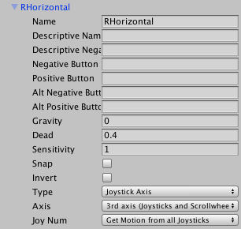

# Theresa Mayhem

## Description

Theresa Mayhem was a two week project I undertook with two other developers for my final weeks at Makers Academy. It is a simple game designed to be played on a controller using just the two analogue sticks. Here is a video preview of [Theresa Mayhem](https://www.youtube.com/watch?v=FhtagoGMX2g).

## How to Use

The Unity editor is required to preview the game; to view all of our written code, navigate to `Assets/Scripts`.
1. Set up Unity Editor software.

2. Clone the GitHub repo to your local machine.

3. Navigate to `Assets/_Scenes` and double click `Theresa Mayhem.unity`. This should start up Unity with all the correct settings and assets.

4. If using Windows go to step 5. Plug in controller and press `cmd + p`, The game should now be playable.

5. Windows uses different input settings to MacOS so we'll need to change those first before starting up the game. Navigate to `Edit` at the top of your window, click on `Project Settings` and go to `Input`. This will open up the InputManager. Under `Axis` change the `RHorizontal` Axis to 4th axis, and the `LHorizontal` Axis to 5th axis. Screenshots below.

## Technologies Used

- Unity
- C#
- MakeHuman

## Challenges

Due to the large files sizes, GitHub was not a viable option when it came to version control. We struggled using the version control that Unity provides. Unity collab was in beta at the time, and this meant that issues would crop up now and again. Often times this would cause overwrites of other peoples work.
  
In addition anytime a partner wanted to push a piece of work they had to pull first to get up to date. This presented a problem when working with the interface in Unity. Any changes made to the interface where unable to be saved like the files could and so when pulling, all changes to the interface where reset.
 
## Developed By

[Jack Kelly](https://github.com/JWKelly29), [Chris Marriot](https://github.com/Chrixs), [Tom Fuller](https://github.com/tomfuller)
